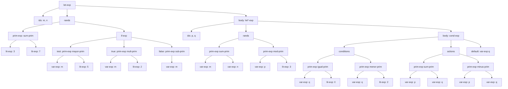
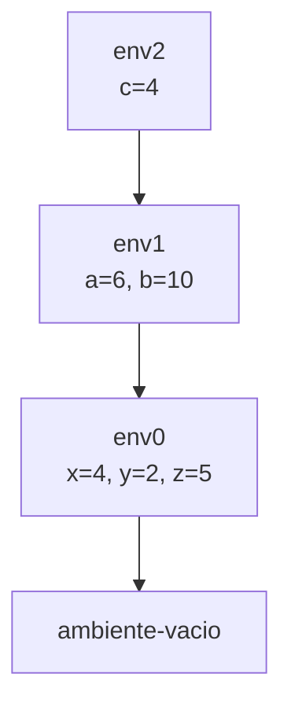

# Informe Teórico — Parte 4

**Taller 2: Mi primer intérprete (MiniLang)**  
**Curso:** Fundamentos de Lenguajes de Programación — 2026-1  
**Responsable:** Mauricio Alejandro Rojas

---

## 4.1 Árbol de Sintaxis Abstracta (AST)

Expresión analizada:

```
let m = +(3, 7)
    n = if >(m, 5) then *(m, 2) else sub1(m)
in
let* p = +(m, n)
     q = mod(p, 3)
in
cond
  ==(q, 0) ==> +(p, q)
  <(q, 2)  ==> -(p, q)
  else     ==> q
end
```



---

## 4.2 Traza de evaluación

Expresión analizada, partiendo del ambiente inicial $[\text{x}=4,\ \text{y}=2,\ \text{z}=5]$:

```
let a = +(x, y)
    b = *(y, z)
in
if >(a, b)
then
  let c = -(a, b)
  in +(c, z)
else
  let c = -(b, a)
  in *(c, x)
```

### Pasos de la traza

**Paso 1** — Evaluar `+(x, y)` en $\text{env}_0 = [\text{x}=4,\ \text{y}=2,\ \text{z}=5]$

$$\text{value-of}(+(x,y),\ \text{env}_0) = 4 + 2 = 6$$

**Paso 2** — Evaluar `*(y, z)` en $\text{env}_0$

$$\text{value-of}(*(y,z),\ \text{env}_0) = 2 \times 5 = 10$$

**Paso 3** — Extender ambiente: $\text{env}_1 = [\text{a}=6,\ \text{b}=10\ |\ \text{env}_0]$

**Paso 4** — Evaluar condición `>(a, b)` en $\text{env}_1$

$$\text{value-of}(>(a,b),\ \text{env}_1) = (6 > 10) = \#\text{false}$$

**Paso 5** — Condición es $\#\text{false}$ → se toma la rama `else`

Se evalúa `let c = -(b, a) in *(c, x)` en $\text{env}_1$.

**Paso 6** — Evaluar `-(b, a)` en $\text{env}_1$

$$\text{value-of}(-(b,a),\ \text{env}_1) = 10 - 6 = 4$$

**Paso 7** — Extender ambiente: $\text{env}_2 = [\text{c}=4\ |\ \text{env}_1]$

**Paso 8** — Evaluar `*(c, x)` en $\text{env}_2$

$$\text{value-of}(*(c,x),\ \text{env}_2) = 4 \times 4 = 16$$

**Resultado final: 16**

---

### Diagrama de cadena de ambientes


