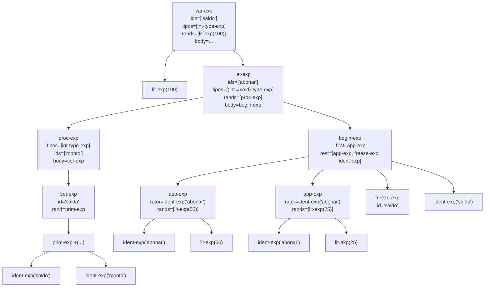
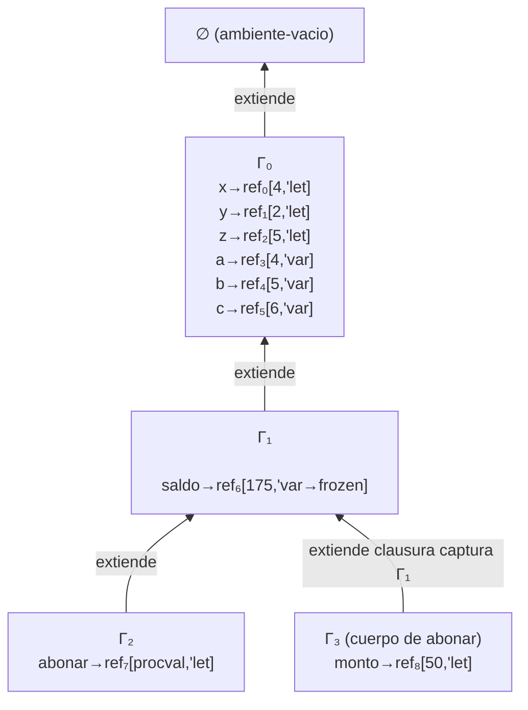

# Informe AST y Traza de Evaluación

**Taller 3 — Fundamentos de Lenguajes de Programación 2026-1**  
**Universidad del Valle**

**Autores:**
- JHORMAN RICARDO LOAIZA — 2359710
- JUAN DIEGO OSPINA — 2359486
- MAURICIO ALEJANDRO ROJAS — 2359701
- JUAN FELIPE RUIZ — 2359397

---

## 4.1 Árbol de Sintaxis Abstracta (AST)

Expresión analizada:

```
var saldo : int = 100
in
let abonar : (int -> void) =
  proc(int monto) set saldo := +(saldo, monto) end
in
begin
  (abonar 50);
  (abonar 25);
  freeze saldo;
  saldo
end
```



---

## 4.2 Traza de Evaluación con Cadena de Ambientes

### Ambiente inicial (antes de evaluar la expresión)

El ambiente inicial predefinido contiene:

| Identificador | Referencia | Valor | Marca |
|:---:|:---:|:---:|:---:|
| `x` | ref₀ | 4 | `'let` |
| `y` | ref₁ | 2 | `'let` |
| `z` | ref₂ | 5 | `'let` |
| `a` | ref₃ | 4 | `'var` |
| `b` | ref₄ | 5 | `'var` |
| `c` | ref₅ | 6 | `'var` |

---

### Paso 1: Evaluar `var-exp`

**Expresión evaluada:**
```
var saldo : int = 100 in ...
```

**Ambiente:** $\Gamma_0 = \{x \mapsto \text{ref}_0, y \mapsto \text{ref}_1, z \mapsto \text{ref}_2, a \mapsto \text{ref}_3, b \mapsto \text{ref}_4, c \mapsto \text{ref}_5\}$

**Acción:** Se evalúa `100` → resultado `100`. Se crea nueva celda en el store:

| Referencia | Valor | Marca |
|:---:|:---:|:---:|
| ref₆ | 100 | `'var` |

Se extiende el ambiente:

$$\Gamma_1 = \Gamma_0[saldo \mapsto \text{ref}_6]$$

**Resultado del paso:** Continúa evaluando el cuerpo en $\Gamma_1$.

---

### Paso 2: Evaluar `let-exp` (ligadura `abonar`)

**Expresión evaluada:**
```
let abonar : (int -> void) = proc(int monto) set saldo := +(saldo, monto) end in ...
```

**Ambiente:** $\Gamma_1$

**Acción:** Se evalúa `proc(int monto) set saldo := +(saldo, monto) end` en $\Gamma_1$.  
Esto construye una clausura capturando $\Gamma_1$:

$$\text{procval}(\text{ids}=[\texttt{monto}],\ \text{body}=\texttt{set-exp},\ \text{env}=\Gamma_1)$$

Se crea la referencia (inmutable, tipo `'let`):

| Referencia | Valor | Marca |
|:---:|:---:|:---:|
| ref₇ | procval(monto, set-exp, Γ₁) | `'let` |

$$\Gamma_2 = \Gamma_1[abonar \mapsto \text{ref}_7]$$

**Resultado del paso:** Continúa evaluando `begin-exp` en $\Gamma_2$.

---

### Paso 3: Evaluar `begin-exp` — Primera aplicación `(abonar 50)`

**Expresión evaluada:**
```
(abonar 50)
```

**Ambiente:** $\Gamma_2$

**Acción:**
1. Se evalúa `abonar` → `deref(ref₇)` = procval con cuerpo `set saldo := +(saldo, monto)`, env = $\Gamma_1$.
2. Se evalúa `50` → `50`.
3. Se crea referencia `'let` para el parámetro:

| Referencia | Valor | Marca |
|:---:|:---:|:---:|
| ref₈ | 50 | `'let` |

$$\Gamma_3 = \Gamma_1[monto \mapsto \text{ref}_8]$$

4. Se evalúa el cuerpo `set saldo := +(saldo, monto)` en $\Gamma_3$:
   - `deref(apply-env-ref(Γ₃, saldo))` = `deref(ref₆)` = 100
   - `deref(apply-env-ref(Γ₃, monto))` = `deref(ref₈)` = 50
   - `+(100, 50)` = 150
   - `setref!(ref₆, 150)` — se actualiza el store

**Estado del store después del paso 3:**

| Referencia | Valor | Marca |
|:---:|:---:|:---:|
| ref₆ | **150** | `'var` |
| ref₇ | procval(...) | `'let` |
| ref₈ | 50 | `'let` |

**Resultado:** `void`

---

### Paso 4: Segunda aplicación `(abonar 25)`

**Expresión evaluada:**
```
(abonar 25)
```

**Ambiente:** $\Gamma_2$

**Acción:** Igual al paso anterior; se crea ref₉ para `monto=25`:

| Referencia | Valor | Marca |
|:---:|:---:|:---:|
| ref₉ | 25 | `'let` |

En el cuerpo: `+(150, 25)` = 175 → `setref!(ref₆, 175)`.

**Estado del store después del paso 4:**

| Referencia | Valor | Marca |
|:---:|:---:|:---:|
| ref₆ | **175** | `'var` |

**Resultado:** `void`

---

### Paso 5: `freeze saldo`

**Expresión evaluada:**
```
freeze saldo
```

**Ambiente:** $\Gamma_2$

**Acción:**
- `apply-env-ref(Γ₂, saldo)` = ref₆
- `deref-mark(ref₆)` = `'var` ✓
- `setref-mark!(ref₆, 'frozen)`

**Estado del store después del paso 5:**

| Referencia | Valor | Marca |
|:---:|:---:|:---:|
| ref₆ | 175 | **`'frozen`** |

**Resultado:** `void`

---

### Paso 6: Evaluar `saldo` (última expresión del `begin`)

**Expresión evaluada:** `saldo`

**Ambiente:** $\Gamma_2$

**Acción:** `apply-env(Γ₂, saldo)` = `deref(ref₆)` = **175**

**Resultado final del programa:** **175**

---

### Diagrama de cadena de ambientes al evaluar el cuerpo de `abonar` (primera invocación)



> **Nota:** La clausura `abonar` captura $\Gamma_1$ (no $\Gamma_2$) porque fue construida en ese ambiente. Al invocarla, el ambiente del cuerpo $\Gamma_3$ extiende $\Gamma_1$ directamente con `monto`, saltando el frame de `abonar`. Por eso `monto` y `saldo` son visibles en el cuerpo, pero no `abonar` (no es recursiva).

Las referencias se anotan con su estado **al momento de la primera invocación**:
- ref₆: marcada `'var` (aún no congelada)
- ref₈: marcada `'let` (parámetro formal — inmutable)
